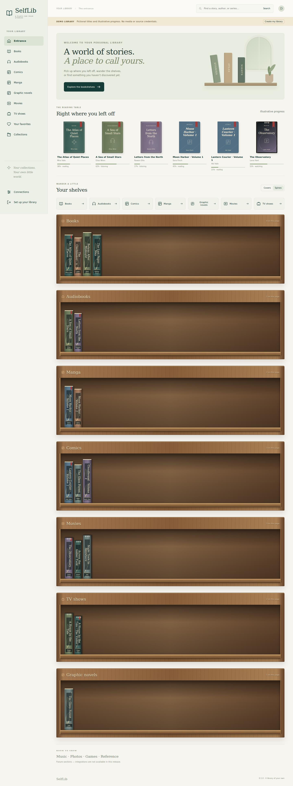
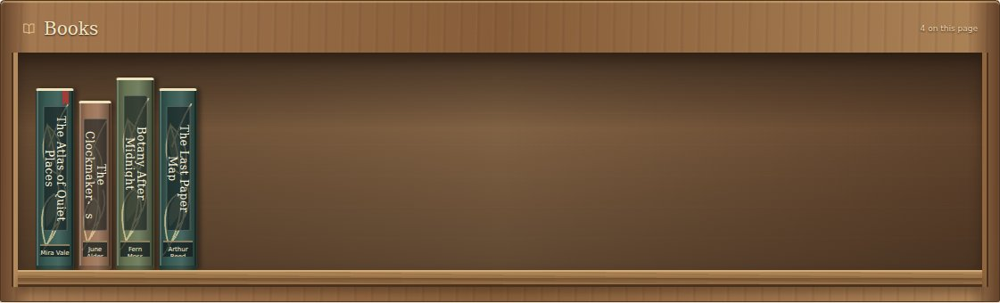
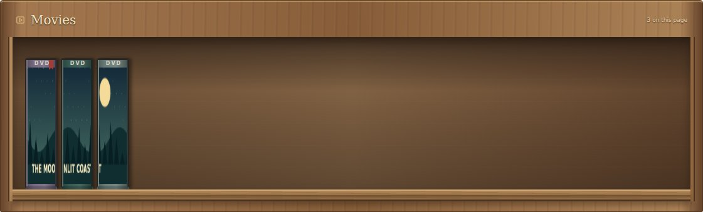
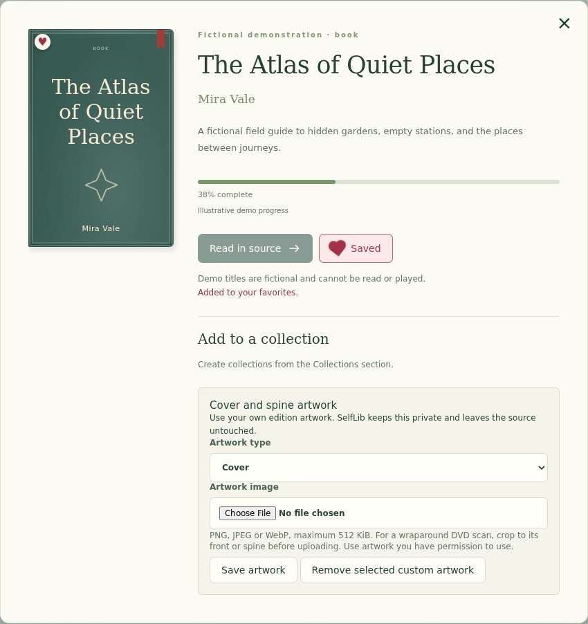
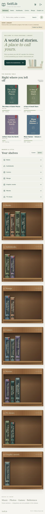
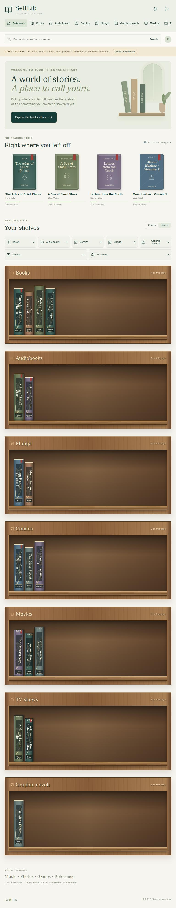

# SelfLib

A self-hosted personal library for your digital collections. Browse shelves, pull out a book or film, and open it in the service that already manages it.

SelfLib **0.1.0** is a single-owner first milestone. It connects to **Audiobookshelf, Komga, and Jellyfin**. Every connection is optional; start with one, or explore the clearly labeled fictional demo without an account.



## What works

- Responsive entrance and separate Books, Audiobooks, Comics, Manga, Graphic Novels, Movies, and TV Shows shelves. Komga rooms follow configurable library mappings.
- Full illustrated spine uploads, continuous artwork across ordered box-set collections, private cover overrides and DVD-style cases. Jellyfin Box artwork is preferred where supplied, with existing-cover fallback. No automatic third-party DVD or fan-art scraping.
- Physical wooden bookcases with backboards, side posts and a plank under every row. Spine-first browsing, varied book heights/thicknesses, pull-out hover/focus interactions, a cover view, and keyboard-accessible detail dialogs.
- Full-text metadata search, persistent favorites with filled animated hearts that move with covers, and mixed collections.
- Source-reported reading/listening/watching progress as of the last manual sync.
- Connection setup, testing, editing, removal, manual sync, health and timestamps. Jellyfin viewer sign-in exchanges passwords server-side for encrypted tokens.
- Cached metadata and artwork remain available during source outages.
- First-run owner wizard, local login/logout, server-side encrypted source credentials.
- One Node process, SQLite, locally bundled assets, no runtime CDN or telemetry.

### Honest limits

Adapters are **official-contract fixture-tested**, not live-tested against personal servers. See [integration contracts](docs/integrations.md) and [verification](docs/verification.md). Source-app handoff opens item detail pages, where the source selects its reader/player and resumes progress; it can require a separate login. Embedded reading/playback is not implemented.

This version supports one owner, 10 connections, 10,000 items/100 pages per source, one sync at a time, a two-minute sync budget, and a 64 MiB artwork cache. SelfLib does not store media, transcode, manage source collections, or update source progress. Its own favorites and collections are independent of source favorites.

Navidrome, Immich, Paperless-ngx, Playnite, RomM, and a walkable 3D room are **future milestones**. They cannot be configured yet. There is no subpath installation, SSO, multi-user sharing, automatic sync, or offline downloaded-media mode.

## Quick start

Requires Docker Engine/Desktop with Compose v2 on **Linux AMD64**. Windows hosts can use Docker Desktop's Linux containers. ARM64 is **not verified or advertised as supported**.

**No public prebuilt image has been published yet.** The included Dockerfile builds this version without installing Node on your host. CI prepares an AMD64 image; the manual tagged release workflow can publish to GHCR once release/package permissions are ready. Do not substitute an assumed registry image.

```bash
git clone https://github.com/koson123/SelfLib.git
cd SelfLib
# Until this milestone is merged, review the implementation branch:
git switch feat/first-library-milestone
cp .env.example .env
docker compose up -d --build
docker compose exec selflib cat /data/setup.token
```

Open **http://localhost:3000**. Explore the demo, or enter the setup token to create the owner account. The token is generated on first run and removed after setup. Then open **Connections**, add any one source, test it, save it, and synchronize.

For LAN or HTTPS access, set `APP_URL` to the exact root URL used by your browser and intentionally change the bind address. [Installation](docs/installation.md) explains networking, permissions, reverse proxies, and TLS. Real credentials should travel over HTTPS.

## Screenshots

These screenshots are captured from the running fictional demo; no source credentials or personal collections appear.







| Phone viewport                                                 | Tablet viewport                                                  |
| -------------------------------------------------------------- | ---------------------------------------------------------------- |
|  |  |

## Documentation

- [Installation and reverse proxies](docs/installation.md)
- [Configuration and secrets](docs/configuration.md)
- [Integration setup and API contracts](docs/integrations.md)
- [Backups, restore, upgrades and key rotation](docs/operations.md)
- [Architecture and adapter development](docs/architecture.md)
- [Development and verification](docs/development.md)
- [Measured results and limitations](docs/verification.md)
- [Roadmap](docs/roadmap.md), [changelog](CHANGELOG.md), [contributing](CONTRIBUTING.md), [security](SECURITY.md)

## Troubleshooting

| Symptom                         | What to check                                                                                                                    |
| ------------------------------- | -------------------------------------------------------------------------------------------------------------------------------- |
| Origin rejected on setup/login  | `APP_URL` must match scheme, hostname and port in the browser. Recreate the container after changing `.env`.                     |
| Source unreachable              | Container DNS/network access, final API URL, valid TLS certificate. Redirects are refused; enter the final URL.                  |
| Endpoint blocked                | Explicitly allow private LAN access for that source. `localhost` inside Docker is the SelfLib container, not your other service. |
| Authentication failed           | Account-bound credential and actual account permissions. An API key is not always interchangeable with a user access token.      |
| Empty shelf                     | Save and synchronize first; check health/errors, intended user access, and demo/real-library switch.                             |
| Progress seems old              | Sync manually; progress is a snapshot, not a live player session.                                                                |
| Missing artwork                 | Source image format/size, cache budget, or 200-item-per-sync artwork bound. Further syncs fill uncached covers.                  |
| Permission denied under `/data` | Named volume is recommended. Bind mounts must belong to UID/GID 10001. Never use `chmod 777`.                                    |
| Unsupported database version    | Use a matching application version or restore its matching backup. Do not manually change `user_version`.                        |

## License and inspiration

SelfLib uses the MIT license to keep adapter and interface contributions straightforward. The shelf implementation and its CSS/inline SVG assets are original; upstream design ideas and reviewed commits are recorded in [THIRD_PARTY_NOTICES.md](THIRD_PARTY_NOTICES.md). Dependency notices are preserved in installed packages and documented separately. Existing media services remain separate applications with their own licenses.
